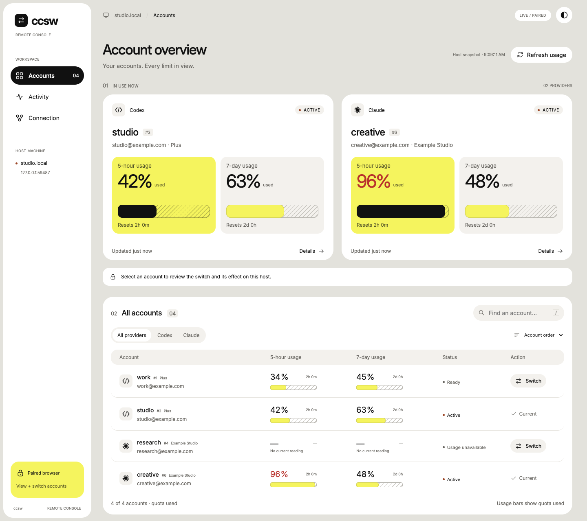

# ccsw

One place for your [OpenAI Codex CLI](https://github.com/openai/codex) and
[Claude Code](https://github.com/anthropics/claude-code) accounts. Save logins,
check usage, and switch accounts from your terminal or a private browser console.

[Install](#install) · [Remote Console](docs/remote-console.md) ·
[CLI guide](docs/usage.md) · [Changelog](CHANGELOG.md)

- **One roster, two providers.** Switch by name, email, or slot without logging in again.
- **Every limit in view.** Track 5-hour, 7-day, and model-specific usage, reset times, and credits.
- **Access from another device.** Check your host and confirm account switches over Tailscale.
- **Automatic Claude switching.** Move to another Claude Code account before a rate limit.
- **Separate sessions.** Run different accounts side by side and assign accounts to directories.
- **Portable accounts.** Export and import both providers, including existing `.cswap` backups.

## Remote Console

In `ccsw`, select **Remote Console → Start and open browser**. The browser opens
with a one-use pairing link and connects automatically. Choose **Tailscale**
to connect from another device, or run `ccsw serve` from the CLI.

View live quota, search accounts, inspect details, and confirm a switch from
your desktop or phone.

Choose **Paper** or **Bitmap**, with automatic system colors or manual light and
dark modes. Usage at 90% or above turns red. Credentials stay on the host.

<picture>
  <source media="(prefers-color-scheme: dark)" srcset="docs/images/remote-console-paper-dark.png">
  
</picture>

*Paper theme with example accounts. [More screenshots and setup](docs/remote-console.md).*

Remote Console is included in **v0.9.0 and newer**. See [installation and upgrades](docs/installation.md).

## Terminal dashboard

Run `ccsw` for the account dashboard, or `ccsw watch` for a live usage monitor.
Add accounts, switch logins, and inspect limits without leaving the terminal.


[Account and CLI guide](docs/usage.md) · [Live monitor screenshot](docs/usage.md#dashboard-tui)

## Install

Download a binary from the [releases page](https://github.com/newbdez33/ccsw/releases),
extract it, and put `ccsw` on your `PATH`:

| Platform | Builds |
| --- | --- |
| macOS | Apple Silicon and Intel |
| Linux / WSL | x86_64, glibc or static musl |
| Windows | x86_64 |

Or install from source with Rust 1.88 or newer:

```bash
cargo install --git https://github.com/newbdez33/ccsw --locked
```

Save your existing provider logins, then open the dashboard:

```bash
ccsw add
ccsw
```

See [provider setup](docs/installation.md#provider-setup),
[adding more accounts](docs/usage.md#add-more-accounts), and
[upgrade instructions](docs/installation.md#upgrade).

## Documentation

| Guide | Topics |
| --- | --- |
| [Installation](docs/installation.md) | Platform builds, provider setup, and upgrades |
| [Account and CLI guide](docs/usage.md) | Logins, switching, usage, automation, JSON, and data locations |
| [Remote Console](docs/remote-console.md) | Pairing, themes, phone access, Tailscale, and read-only mode |
| [Session profiles](docs/sessions.md) | Parallel accounts, directory mappings, and shared settings |
| [Export and migration](docs/transfers.md) | Backups, imports, and migration from claude-swap |
| [Development](docs/development.md) | Local builds, checks, release maintenance, and design notes |

## License

[MIT](LICENSE). Built on work from
[claude-swap](https://github.com/realiti4/claude-swap) and
[codex-switch](https://github.com/xjoker/codex-switch). See [NOTICE](NOTICE) for
attributions and [Origins](docs/development.md#origins) for details.
