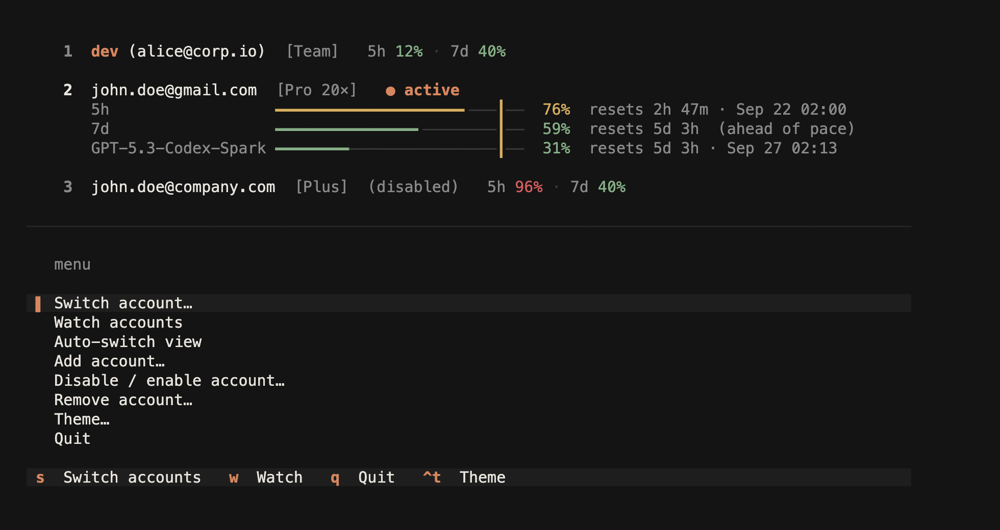
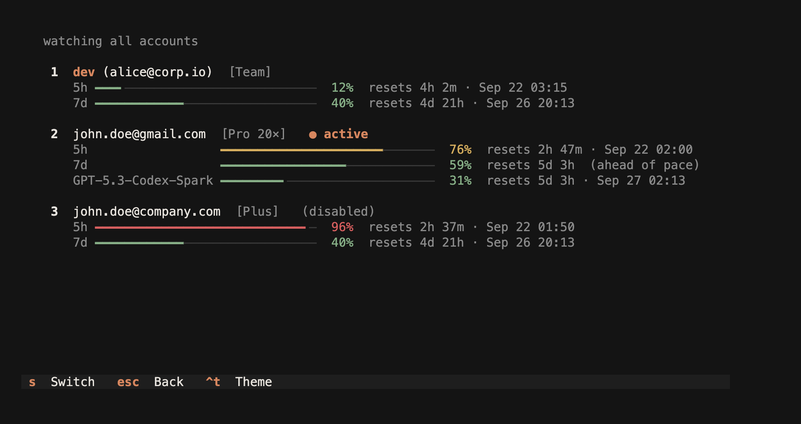

# ccsw

Multi-account switcher for the [OpenAI Codex CLI](https://github.com/openai/codex) and
Claude Code. Keep several Codex and Claude logins on one machine in one roster, switch any
of them without logging in again, watch every account's usage in a live dashboard, let it
switch Claude Code accounts for you before you hit a rate limit, and run different accounts
side by side in separate terminals. Session mode, export and import cover both providers.

The dashboard (`ccsw`) and the live monitor (`ccsw watch`):





`ccsw` is a Rust port of [claude-swap (`cswap`)](https://github.com/realiti4/claude-swap)
that manages Claude Code and Codex accounts in one roster: the commands, options, JSON
output, settings, export format and full-screen dashboard follow `cswap`, so `cswap list`
becomes `ccsw list` and a `.cswap` export imports as is.

The Claude Code mechanics (Keychain and credentials file, `oauthAccount` identity, Claude
Code's lock files, OAuth refresh, the usage API and
[session profiles](https://github.com/realiti4/claude-swap/blob/3a4e5c14873eb5b32f182d55c68da98ac8c0db45/src/claude_swap/session.py))
are ported from `cswap` at commit `3a4e5c1`, with the credential and process guards adapted
to Rust and the shared store. The Codex mechanics (credential file, identity, usage API,
token refresh, app-server daemon) come from
[codex-switch](https://github.com/xjoker/codex-switch). Both are MIT licensed; see
[NOTICE](NOTICE).

> `ccsw` manages local credential files. Never publish `~/.ccsw`, `auth.json`,
> tokens, or unredacted debug output.

## Install

Download the archive for your platform from the
[releases page](https://github.com/newbdez33/ccsw/releases) (macOS arm64 / x86_64,
Linux x86_64 as a glibc build and a static musl build, Windows x86_64), unpack it, and
put `ccsw` on your `PATH`. The musl archive runs on any Linux, including older WSL
distributions. Or build it with Rust 1.88 or newer:

```bash
cargo install --git https://github.com/newbdez33/ccsw --locked
```

Codex must keep its credentials in `auth.json` (the default). If your
`~/.codex/config.toml` sets `cli_auth_credentials_store`, it must be `"file"`.

Claude Code's login is read from the macOS Keychain (service "Claude Code-credentials") or
from `~/.claude/.credentials.json`, and the account identity from `~/.claude.json`;
`CLAUDE_CONFIG_DIR` is honoured. Set `CCSW_KEYCHAIN=off` to use the file backend only.

## Upgrade

`ccsw --version` prints the installed version; the [CHANGELOG](CHANGELOG.md) lists what
each release changed. Upgrading never touches `~/.ccsw`: accounts, settings and the usage
cache carry over. Quit a running dashboard or `ccsw watch` first.

Release binary — fetch the current release and replace the `ccsw` already on your `PATH`
(`SHA256SUMS` next to the archives lists their checksums):

```bash
VERSION=v0.8.2; TARGET=aarch64-apple-darwin   # or x86_64-apple-darwin, x86_64-unknown-linux-gnu, x86_64-unknown-linux-musl
curl -fsSL "https://github.com/newbdez33/ccsw/releases/download/$VERSION/ccsw-$VERSION-$TARGET.tar.gz" | tar xz
install "ccsw-$VERSION-$TARGET/ccsw" "$(command -v ccsw)"
```

On Windows, download `ccsw-v0.8.2-x86_64-pc-windows-msvc.zip` from the
[releases page](https://github.com/newbdez33/ccsw/releases) and replace `ccsw.exe`.

From source:

```bash
cargo install --git https://github.com/newbdez33/ccsw --tag v0.8.2 --locked --force
```

`ccsw upgrade` only prints these instructions; ccsw does not update itself.

## Usage

### Add your first account

Run `ccsw` and open **Add account…**. **From current logins** saves the logins Codex and
Claude Code already hold. **Add new account** signs a new Codex account in through your
browser and activates it (the Codex CLI must be on your `PATH`; press `Esc` to cancel).
**From a token…** registers an OpenAI API key or an Anthropic setup-token / API key.

From the command line, `ccsw add` snapshots the logins you already have:

```bash
ccsw add            # the current Codex login and the current Claude Code login
ccsw add claude     # only the Claude Code login
ccsw add codex      # only the Codex login
```

`ccsw add` captures whichever of the two logins exist.

### Add more accounts

For Codex, select **Add account… → Add new account** again and sign in with the next
account. The login runs in a temporary Codex home, so it does not revoke the previous login.
Signing into a managed account again updates its stored credentials in place.

Do **not** run `codex logout` first: it can revoke a saved refresh token. Recent
Codex versions can also clear the previous login when you run `codex login`
directly. Use the dashboard to add another account.

For Claude Code, log in with `claude` (`/login`), then run `ccsw add claude`. Do not
run `/logout` first.

Use `ccsw alias 2 work` to give a saved account a short name.

An API key can be registered without touching the current login:

```bash
ccsw add-token sk-...                        # OpenAI API key
ccsw add-token - --slot 3 < key.txt          # read the key from stdin
ccsw add-token sk-ant-oat01-...              # Anthropic setup-token
ccsw add-token sk-ant-api03-...              # Anthropic API key
```

### Switch accounts

```bash
ccsw switch                  # rotate to the next account (say codex|claude when both are managed)
ccsw switch 2                # by slot number
ccsw switch 5                # by slot: slots are one list across Codex and Claude
ccsw switch claude           # rotate among the Claude accounts
ccsw switch claude --strategy best
ccsw switch user@example.com # by email
ccsw switch work             # by alias
ccsw switch --strategy best  # the account with the most quota left
ccsw switch --strategy next-available   # rotate, skipping rate-limited accounts
```

A running Claude Code picks up the switched login after about 30 seconds when its
credentials live in the Keychain, and immediately when they live in the file.

Codex 0.157 and newer runs interactive sessions through a shared local app-server
daemon that loads `auth.json` once. When that daemon is running, `ccsw switch`
restarts it (`codex app-server daemon restart`) so new and reconnecting Codex sessions use
the selected account; a turn that was in progress is interrupted. `codex exec` and
`codex --no-daemon` sessions read the file when they start, so restart those yourself.

### See every account's usage

```bash
ccsw list                # a Codex block and a Claude block: 5h / 7d / per-model pools with reset times
ccsw list claude         # only the Claude accounts
ccsw status              # the active account of each provider
ccsw list --token-status # add stored-token expiry diagnostics
ccsw list --fetch-all    # measure every stale account in this one pass
```

Usage is fetched on demand (the active account plus one other account per command) and
cached for three minutes, so run `ccsw list` again to fill in the remaining rows, or pass
`--fetch-all` to measure every stale row at once. Each account's poll budget still applies.
Claude rows add a `$$` line for extra-usage spend and per-model windows such as
`Fable: 62%`. The dashboard shows an account's saved limit resets (Codex's reset credits,
Claude Code's `/limit-reset` grants) as a red heart with a green count (`♥ n`); when a credit or grant
has an end date, the soonest one follows as `(in 10d)`. Anthropic lists those grants only
for the Claude Code CLI, so Claude usage requests identify as the installed Claude Code
(`claude-cli/<version> (external, cli) ccsw/<version>`, the version read from the `claude`
on your `PATH`).

### JSON output for scripting

`--json` works with `list`, `status` and `switch`; stdout carries exactly one JSON
document (`schemaVersion: 2`) and nothing is printed to stderr. A handled error becomes
`{"schemaVersion": 2, "error": {"type": "...", "message": "..."}}` with exit 1.

Account rows and switch references carry `provider`. `active` is
`{"codex": n, "claude": n}` on `list` and a per-provider object on `status`.

```bash
ccsw list --json                     # accounts[] with usage.fiveHour / sevenDay / scoped[], plus credits (Codex) or spend (Claude)
ccsw list claude --json --fetch-all  # collectors: every stale row measured in this pass (not one candidate per call); `claude` filters the output
ccsw status --json                   # {"active": {"codex": row|null, "claude": row|null}}
ccsw switch --strategy best --json   # {"switched": true, "from": ..., "to": ..., "reason": "switched"}
ccsw auto --once --json              # one compact JSON event per line
```

### Automatic switching (Claude Code)

```bash
ccsw auto                    # foreground loop, switch Claude Code accounts at 90% used
ccsw auto --threshold 80     # switch earlier
ccsw auto --once             # one tick, outcome in the exit code (0 switched, 1 error, 2 nothing to do, 3 blocked)
ccsw auto --dry-run          # log what it would do, never switch
ccsw auto --json             # one JSON event per line (schemaVersion 2, provider "claude")
```

Auto-switch covers Claude Code accounts only. A running Claude Code session picks the new
login up by itself (on the next message, or within about 30 seconds with the macOS Keychain),
so switching early keeps you working. Codex sessions keep the account they started with
until they restart — Codex CLI's app-server daemon loads `auth.json` once and re-reads it
only for the account it already holds — so there is no Codex auto-switch; use `ccsw
switch` and restart the session. `ccsw auto` on a roster without a Claude Code account
exits 1 and says so. While the Keychain is locked, the engine holds (`active-idle`) rather
than failing over.

Defaults live in `settings.json`; change them with `ccsw config set autoswitch.threshold 80`.
`autoswitch.model` names that no account reports produce one `config-warning` event.

### Run two accounts at once (session mode)

```bash
ccsw run 2                       # launch the provider that owns account 2
ccsw run work -- --resume        # pass arguments to the selected CLI
ccsw run 2 --require-session     # refuse a plain default-login launch
ccsw map 2 ~/work/client         # use account 2 in this directory tree
ccsw run claude                  # use this provider's nearest directory mapping
ccsw unmap ~/work/client claude  # remove one provider's mapping
ccsw unmap ~/work/client         # remove both providers' mappings
eval "$(ccsw env 2)"             # pin this shell without starting the CLI
eval "$(ccsw env claude --unset)" # unpin one provider
eval "$(ccsw env --unset)"        # unpin both (--shell fish|pwsh also supported)
```

Each account has a persistent profile under `~/.ccsw/sessions/`. Codex uses
`CODEX_HOME`; Claude Code uses `CLAUDE_CONFIG_DIR` and a separate macOS Keychain
item. An account number or alias selects its provider. A directory can map one
account per provider; when both apply, pass `codex`, `claude`, or an account.

Codex copies `config.toml` and shares `AGENTS.md`, `prompts/`, and `skills/`.
Claude Code shares `settings.json`, `keybindings.json`, `CLAUDE.md`, `skills/`,
`commands/`, and `agents/` from the default `~/.claude` directory. These are
symlinks on macOS/Linux and copies updated at launch on Windows. `--no-share`
removes managed shares and keeps local profile files.

History stays separate by default. `--share-history` shares it on macOS/Linux;
for Claude Code, existing profile transcripts and prompt history are merged
before linking `projects/` and `history.jsonl`. This flag is independent of
`--no-share`. Windows does not support history sharing.

Like cswap, selecting the active default login without a preset provider home
launches the CLI directly. `--require-session` refuses that fast path. Isolated
Claude sessions require an OAuth login or setup token; managed API keys are not
supported. Authentication override variables are removed for an isolated launch.

Claude Code owns token refresh while its profile is running. ccsw reads rotated
profile credentials before later usage, refresh, switching, and launch commands;
Windows also captures them after the child exits. A running profile cannot be
switched into the default login, removed, or moved. Unreadable credentials or PID
records block those operations until they can be checked. If `/login` changes a
profile's identity, save that login separately before reusing its original slot.
`run` reserves the profile before the CLI starts and waits for any in-flight
credential refresh. `env` only prepares the profile and prints shell commands;
it does not reserve the shell. After a direct CLI launch, ownership checks depend
on the CLI's PID records. Prefer `run` when other commands can change the account.
Saving a new login invalidates the old profile credentials after its sessions
close. `purge` also refuses running profiles and removes their managed Keychain items.

### Dashboard (TUI)

```bash
ccsw          # or: ccsw tui
ccsw watch    # straight to the live monitor
```

The dashboard shows the active account as a card with 5h, 7d and per-model bars, the
other accounts as one-line summaries, and the menu; when the terminal is short the
accounts stay whole and the menu scrolls, keeping its title and the highlighted entry
in view. Rows wider than the terminal wrap onto the next line, as in `cswap`. Accounts
that still do not fit scroll behind a scrollbar (mouse wheel or `PgUp`/`PgDn`), and so do
the switch and watch lists. The dashboard, switch and watch screens list a `codex` section and then a `claude` section when both are present; `ccsw watch` shows every account
as a live card. Both are pictured at the top of this page.

### Other commands

```bash
ccsw remove 2
ccsw disable 2 / ccsw enable 2     # hold out of / return to auto-rotation
ccsw alias 2 dev / ccsw alias 2 --unset / ccsw alias
ccsw move 2 1 / ccsw swap 1 2
ccsw config [list|get KEY|set KEY VALUE|unset KEY|path]
ccsw export backup.ccsw [--account 2] / ccsw import backup.ccsw [--force]
ccsw import --from-cswap [DIR] [--retire] [--json]   # read a claude-swap store in place
ccsw purge
```

`ccsw export` writes a version-2 `.ccsw` file with every Codex and Claude account
(`--account` limits it to one). The active account of each provider is exported from its
live login when that is the same account, and a token Claude Code rotated inside a session
profile is folded into the slot first, so an export can refresh a stored snapshot.
`ccsw import` reads those files, version-1 `.ccsw` files from earlier releases (all Codex)
and `cswap` exports (`.cswap`, all Claude Code), matching accounts on provider, email and
organization; `--force` overwrites matches in place and a quarantined dead-token slot is
replaced without it. Importing over a Claude account whose session profile is running keeps
that session on its old login until it restarts. Exports hold credentials in plain JSON:
keep them private.

`ccsw import --from-cswap` reads a claude-swap store in place, with no export step: the
roster from `sequence.json`, each account's credentials from the macOS Keychain (service
`claude-swap`) or its base64 `.enc` file, and the `.claude.json` snapshot from `configs/`.
`DIR` defaults to claude-swap's location (`~/.claude-swap-backup`, or
`$XDG_DATA_HOME/claude-swap` on Linux). Reads are `.enc`-wins, as in claude-swap: the
Keychain item is consulted only when the file is absent or corrupt. Add `--retire` to
rename the store to `<dir>.migrated-<stamp>` after a successful run (every account it held
is in ccsw by then, including ones that were already managed), so a leftover claude-swap
cannot keep refreshing the same tokens; `--json` prints the report. Exit 2 means there was
nothing to import (no store, an empty roster, or an already-migrated one).

Every verb accepts `--help`; `ccsw help` lists them all. The `cswap` flag spellings
(`ccsw --list`, `ccsw --switch-to 2`, …) keep working.

## Data locations

Everything ccsw stores lives in `~/.ccsw` (override with `CCSW_HOME`):
the account roster (`sequence.json`), credential snapshots (`credentials/`),
`settings.json`, directory mappings, the usage cache, auto-switch state, session
profiles and a rotating log (`ccsw.log`, 1 MiB, three backups; `--debug` mirrors it
to stderr). The live Codex login is `$CODEX_HOME/auth.json` (default
`~/.codex/auth.json`); `ccsw` backs it up as `auth.json.bak.<timestamp>` (three
kept) before every switch. The outgoing Claude login is backed up under `backups/claude/`
(three kept). During a switch ccsw creates and removes short-lived lock directories
inside `~/.claude`. `CLAUDE_CONFIG_DIR` moves the live Claude location and
`CCSW_KEYCHAIN=off` skips the Keychain.

## Development

```bash
cargo build
env -u CODEX_HOME cargo test --all
cargo clippy --all-targets -- -D warnings
cargo fmt --check
```

The integration tests run the built binary against fake `codex` and `claude` executables
and a local mock of the usage and token endpoints (`CCSW_USAGE_URL`, `CCSW_TOKEN_URL`, and
`CCSW_CLAUDE_USAGE_URL`, `CCSW_CLAUDE_TOKEN_URL` for Claude); tests set
`CCSW_KEYCHAIN=off`, and `CCSW_CLAUDE_LOCK_BUDGET_MS` shortens the Claude lock
wait. Nothing touches the network or your real `~/.codex` or `~/.claude`. Tagging `v*` builds release archives for
macOS, Linux and Windows (`.github/workflows/release.yml`). Changes are listed in
`CHANGELOG.md`.

Design: `docs/specs/2026-09-29-ccsw-design.md` and
`docs/specs/2026-10-07-ccsw-claude-provider-design.md`. Plans: one per phase in
`docs/plans/`. The research notes that pin the `cswap` contract and the Codex mechanics
are in `docs/research/`.

## License

MIT. See `LICENSE` and `NOTICE` for the claude-swap and codex-switch attributions.
