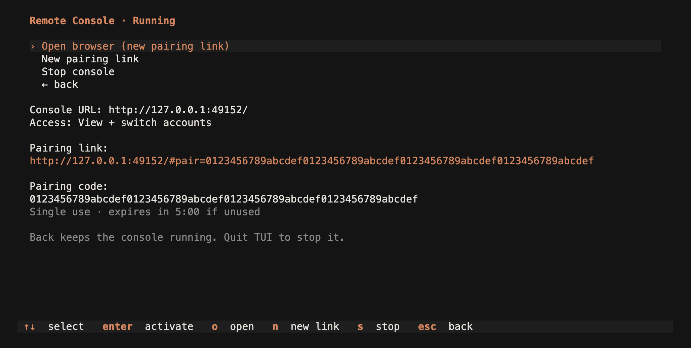
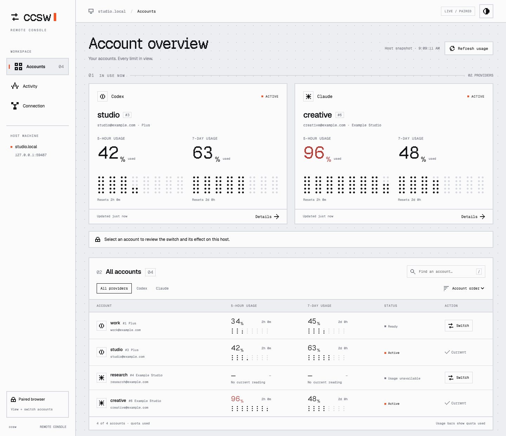
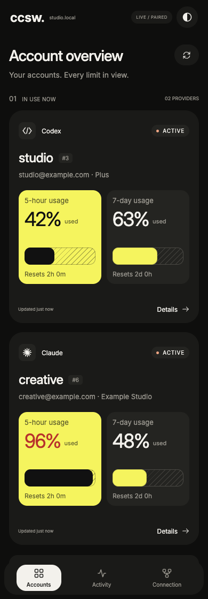

# Remote Console

[Back to overview](../README.md)

Use a browser on your desktop or phone to check account usage and switch the
default Codex or Claude Code login on your host. The console is embedded in
`ccsw`; it needs no separate web server or frontend build.

Remote Console requires **v0.9.0 or newer**. See [installation and upgrades](installation.md).

## Start and pair

Save your accounts with [the dashboard or CLI](usage.md#add-your-first-account),
then start the console on the machine that holds those accounts.

### From the TUI

Run `ccsw`, select **Remote Console**, then **Start and open browser**. Press
Enter or click the action row. The browser opens a pairing link and connects
automatically. The page removes the code from the address bar immediately.

- **Access: This computer** uses loopback. Change it to **Tailscale** before
  starting to connect from another device on your tailnet.
- **Read-only** blocks switches and manual refreshes. Set it before starting.
- An available port is selected at startup. The TUI shows the console URL,
  pairing link, code, and expiry. Share a fresh link with your other device.
- **Open browser** (`o`) creates a new link and opens it on the host.
  **New pairing link** (`n`) creates one without opening a browser.
- **Stop console** (`s`) ends the service. **Back** (`Esc`) keeps it running;
  quitting the TUI stops it and ends its browser sessions.

If a code is expired or already used, generate another link. If the host cannot
open a browser, open the displayed link yourself. In an SSH session, the browser
action runs on the host; use a Tailscale link on your own device instead.
Use `PgUp` / `PgDn` or the mouse wheel to scroll the details in a short terminal.



### From the CLI

```bash
ccsw serve  # http://127.0.0.1:3000/
```

Open the printed URL and enter the pairing code from the terminal. Keep that
terminal running; Ctrl-C stops the server.

- A pairing code works once and expires after five minutes.
- In `ccsw serve`, press Enter in the host terminal for a new code, including
  when you pair another browser. Existing browser sessions stay connected.
- Browser sessions last up to 12 hours. Stopping the server revokes them all.
- **Connection → Disconnect this browser** ends only the current session.

For a view-only console:

```bash
ccsw serve --read-only
```

Read-only mode blocks account switches and manual refresh requests. Background
usage collection continues.

Pairing links use a `#pair=...` fragment. The code is sent only in the pairing
request body, not the request URL, and is not saved in Web Storage. Treat a
fresh link like the pairing code: it grants one browser access. If the browser
already has a valid session, it keeps that session without consuming the code.
Use the CLI when you need a fixed port, a separate server process, or HTTPS
through Tailscale Serve.

## Accounts and usage

The overview shows the active account for each provider and the saved roster.
Search by account name or email, filter by provider, or sort by quota headroom.
Open **Details** for reset times, model-specific limits, credits, extra usage,
and available limit resets. **Activity** lists changes observed during the
current server session.

Bars show quota **used**. Percentages at or above 90% turn red. Unknown usage
stays unknown; details label a last good reading when current data is missing.
**Refresh usage** requests new readings within the same cache, poll budget,
and backoff rules as the CLI. Collection is shared across connected browsers.

Updates arrive live. If the connection drops or the host snapshot is stale,
the console keeps the last view and disables switching until it can verify the
host state again.

## Switch an account

Select **Switch**, review the source and target accounts, then confirm. This
changes the host's default login. Existing isolated session profiles keep their
own accounts.

Codex switches require acknowledgment that restarting its shared daemon can
interrupt an active turn. Restart existing `codex exec` or `codex --no-daemon`
sessions yourself. If the credentials change but the daemon restart fails,
the console reports a partial result and the required follow-up.

File-backed Claude Code sessions pick up the new account on their next message;
macOS Keychain sessions can take about 30 seconds. If the host roster changes
while confirmation is open, close the dialog and review the new state. A lost
response queries the original operation instead of sending another switch.

Login, import, deletion, session profiles, and automation use the
[host CLI](usage.md).

## Appearance

Open **Appearance** from the top bar or pairing screen:

| Setting | Choices |
| --- | --- |
| Theme | **Bitmap** for pixel type and dot meters; **Paper** for smooth type, rounded panels, and hatched quota bars |
| Color mode | **System** (default), **Light**, or **Dark** |

System mode follows device changes live. Manual choices persist in the browser
and sync across its console tabs. Both themes support desktop and phone layouts.

The screenshots below use example accounts from an isolated local server.

**Bitmap on desktop**



**Paper on a phone, in dark mode**



See the desktop Paper theme in [light](images/remote-console-paper.png) or
[dark](images/remote-console-paper-dark.png).

## Access over Tailscale

In the TUI, select **Access: Tailscale** before starting. It detects and verifies
the host's own address. Stop the console before changing access or read-only mode.

From the CLI, bind to the host's own Tailscale address.
Find it with `tailscale ip -4`, then substitute it for the example below:

```bash
ccsw serve --bind 100.101.102.103:3000
ccsw serve --bind 100.101.102.103:3000 --read-only
```

Open the printed URL on the other device and pair it as above. Direct listeners
accept only loopback or an address reported by the local Tailscale client;
wildcard binds are rejected. The server checks a direct Tailscale bind every
30 seconds and stops if it can no longer verify that address.

### HTTPS with Tailscale Serve

Configure the proxy separately and give ccsw the exact HTTPS origin assigned
to your host:

```bash
ccsw serve --external-origin https://host.example-tailnet.ts.net
```

In another terminal:

```bash
tailscale serve --bg 3000
```

Replace the example hostname with your host's HTTPS name. The ccsw listener
stays on loopback. ccsw does not configure Tailscale, ACLs, or Funnel.

Pairing is required even on the tailnet. Use the exact printed URL: Host and
Origin checks reject alternate addresses, and ccsw does not trust forwarded
request headers. Session cookies are HttpOnly and SameSite=Strict, and Secure
with HTTPS. Account responses exclude credentials and raw provider errors.
