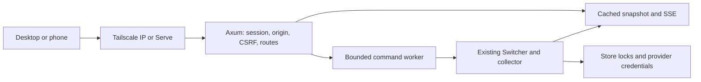

# ccsw remote console

Status: implemented, 2026-10-11. `ccsw serve` embeds the approved interface.
The original interactive design preview remains in `docs/previews/web/`.
Production HTML and request handling live in `src/web/`; both interfaces use
the same bitmap CSS, motion code, icons, and local font assets.

## Decision

Add an opt-in `ccsw serve` command to the existing binary. Serve an embedded web
interface and a small authenticated API. Use the existing account, collection,
and switch code. Support an explicit Tailscale IP bind and a loopback listener
behind Tailscale Serve.

The first version shows accounts and quota, refreshes usage, and switches the
default account for each provider. One server controls one host. A phone opens
the same interface as a desktop browser.

Do not add remote login, credential import/export, a terminal, account deletion,
or arbitrary command execution. Session profiles remain separate from the
host's default login. Auto-switch controls shown in the preview are a later
phase, after the engine has a shared ownership contract.

## Existing contracts

- `Switcher::list_snapshot` already produces account and usage snapshots.
  `CollectMode::StoreOnly` reads cached state; `OnDemand` follows the existing
  poll budget and provider refresh rules.
- `Switcher::switch_to` and the provider switch paths own store locks,
  credential backups, active-account changes, and provider follow-up messages.
  Keep these as the only credential writers.
- `jsonout::usage_projection` contains the quota windows and pace information.
  Reuse its projections, with a separate explicit web response type.
- `src/tui/worker.rs` already keeps blocking provider work off the UI thread.
  Follow that boundary without importing TUI state or its automatic prompt
  confirmations into the server.
- Account slots are global. Each provider has an independent active account.
- A Codex switch can restart the managed app-server daemon and interrupt an
  active turn. A failed daemon restart can leave the new credential saved while
  the daemon still uses the old account. Report this as a partial result.
- Claude applies a file-backed switch on the next message; the Keychain backend
  can take about 30 seconds. Use the actual backend's follow-up message.

## Interface

The overview has two active-account cards, then the full roster. All quota bars
mean **used**, with explicit 5-hour and 7-day labels and reset times. Unknown
usage stays unknown rather than displaying zero. Production account details
also show provider-specific model pools, credits, extra usage, and freshness
when available; the preview uses two windows to establish the layout.

Filter by provider, search by alias/email/slot, and sort by slot or remaining
quota. Keep disabled and expired accounts visible with a clear reason they
cannot be selected. Desktop rows become stacked cards on a phone; navigation
moves to the bottom.

A switch dialog identifies the host, provider, outgoing account, target account,
and effects on sessions. For Codex, require acknowledgment of possible turn
interruption. Do not provide a one-click switch from a notification. Preserve
the provider's active state until the server confirms the result.

Show pending, success, partial success, and failure states. An activity view
records console actions and externally observed active-account changes. It does
not claim to provide the CLI's complete historical audit trail.

The connection page shows the address, access scope, and host. The first real
visit instead shows a pairing form until the browser has a session. If updates
disconnect, label the last snapshot as stale and disable switch controls until
the connection and state are verified again.

## Bitmap interface direction

The preview now uses a restrained bitmap interface. Panels have a solid
`#FBFBFC` background, a 2 px `#D5D8DE` border, and square corners. The page uses
`#EDEEF1` with 2 px `#C9CCD3` dots on a 24 px grid. Text is `#0D0E10`, secondary
text is `#7B808A`, and the only accent is `#FF4F1F`. Orange is reserved for small
signals and transient animation states, with an area budget below 5%.

Geist and Geist Mono render interface text. Geist Pixel Square renders large
English headings; Geist Pixel Circle renders metrics. Source Han Sans handles
Chinese glyphs when needed. Fonts are served locally; upstream revisions and
OFL licenses are included in `docs/previews/web/fonts/`.

`bitmap-motion.js` owns a shared 15 FPS clock. Motion uses discrete frame
updates with no interpolation, easing, opacity fades, shadows, or blur:

- Each changed digit rolls upward in three-frame glyph steps. Units stop before
  higher changed digits. A stopped digit turns orange for exactly one frame.
  A signed delta states the change from the previous reading.
- Quota charts use groups of one or two dot columns. Rows light from bottom to
  top, one group after another from left to right, every two frames. The newest
  two rows are orange for four frames, then become ink. Unlit dots stay gray.
  These charts show quota consumption, not an invented usage history.
- Hover and keyboard focus advance card fills through 25%, 50%, 75%, and 100%
  Bayer density. Each level lasts one frame, for a full transition of about
  267 ms. Exit reverses the levels from the current density. Text becomes white
  at 75% and 100%.
- Icons are 7 by 7 binary matrices. The brand has a small square cursor.
  Reduced-motion mode applies the final state without animation.

In the static preview, **Refresh usage** advances a deterministic sample reading so changes can be
inspected. **Replay preview** replays the current numbers and charts without
changing accounts. **Reset demo** restores the starting data. Existing search,
switch, confirmation, activity, and connection behavior remains available.

## Server boundary



Use Axum, promoted from the repository's development dependencies, and
the existing Tokio runtime. Embed static HTML, CSS, and JavaScript in the release
binary. A JavaScript framework and a separate Node service are unnecessary for
this scope.

Modules:

- `src/cli/serve.rs`: arguments, bind validation, startup, shutdown.
- `src/web/mod.rs`: router, immutable state, bounded work queue, event channel.
- `src/web/auth.rs`: browser pairing and sessions.
- `src/web/api.rs`: typed public projections and action requests.
- `src/web/config.rs`: explicit origin and local Tailscale bind validation.
- `src/web/worker.rs`: shared collection, guarded switches, and activity.
- `src/web/assets/`: small static interface embedded at build time.

Construct the `Switcher` in the blocking worker, as the TUI does. One command
worker serializes mutations within the server. The existing filesystem locks
still coordinate with CLI, TUI, and auto-switch processes. Never hold a new
outer store lock and call a method that takes the same lock again.

Read cached store state on the existing TUI cadence and publish changes. Share
one refresh schedule across browsers. An explicit refresh enters that same
queue and obeys current cache TTLs, poll budgets, OAuth ownership, and backoff.
Opening another browser must not multiply upstream requests.

## Command

```bash
# Loopback by default. The server prints a short-lived browser pairing secret.
ccsw serve

# Bind only to this host's Tailscale address.
ccsw serve --bind 100.64.0.70:3000

# Optional read-only console.
ccsw serve --bind 100.64.0.70:3000 --read-only

# Optional private HTTPS proxy; configured by the operator.
ccsw serve --external-origin https://host.example-tailnet.ts.net
tailscale serve --bg 3000
```

Default bind: `127.0.0.1:3000`. Direct non-loopback listeners must match a local
Tailscale node address, obtained from the local Tailscale client. An address in
`100.64.0.0/10` alone is not proof that it belongs to Tailscale. Support IPv6
socket syntax as well. Refuse wildcard binds for the initial version. If the
requested address disappears, fail closed; do not fall back to a LAN listener.
Revalidate direct Tailscale binds every 30 seconds. An external HTTPS origin
requires a loopback listener; replace the example with the host's actual Serve
hostname. The application does not derive this origin from proxy headers.

Tailscale Serve supports private HTTP/HTTPS proxying of a local service. HTTPS
uses the tailnet's supported DNS/certificate setup; do not promise an HTTPS
certificate for a raw `100.x` address or a custom Headscale domain. Direct HTTP
over the tailnet remains supported. The application does not change Tailscale
ACLs, Serve configuration, or Funnel settings.

Reference: [Tailscale Serve CLI](https://tailscale.com/docs/reference/tailscale-cli/serve).

## Access and secrets

Tailscale controls network reachability. Application pairing controls who can
read account metadata and change the host's login. Both are required; a device
on the same tailnet is not automatically an authorized console user.

On startup, generate a one-use 256-bit secret with a short expiration and show
it in the local terminal. The browser submits it in a POST body, never a request URL.
The TUI can open a one-use `#pair=...` link. The page removes the fragment before
making requests, checks for an existing session, and pairs only when needed.
Rate-limit pairing attempts. Keep sessions in memory for the first version;
server restart revokes them. Pairing codes expire after five minutes; sessions
expire after 12 hours. Enter in the host terminal rotates the pairing code.
The server's `--read-only` scope always overrides
the browser. Session expiry is bounded and reported to the UI.

Use an HttpOnly, SameSite=Strict session cookie. Set Secure on HTTPS; direct HTTP
is allowed only on the validated loopback/Tailscale listener. Do not store the
pairing secret or session secret in localStorage. Require an exact allowed Host
and Origin plus a session-bound CSRF token on mutations; provide no permissive
CORS. Protect pairing against cross-origin requests too. Apply the configured
external origin when behind Serve; do not trust arbitrary forwarded headers.

Account projections are an allowlist. Never return credential objects, tokens,
Keychain entries, raw store files, full local paths, or unfiltered debug logs.
Treat provider errors as untrusted; expose a stable error code and a sanitized
message. Send private API responses with `Cache-Control: no-store`; use a strict
same-origin CSP and `frame-ancestors 'none'`.

## API and consistency

| Endpoint | Purpose |
| --- | --- |
| `GET /api/v1/session` | Resume a session; return host, origin, access scope, expiry, and CSRF token |
| `POST /api/v1/session` | Consume the pairing secret and create a session |
| `DELETE /api/v1/session` | Revoke the current browser session |
| `GET /api/v1/snapshot` | Active accounts, roster, usage, freshness, revision, activity, and this session's operations |
| `GET /api/v1/events` | Authenticated SSE: snapshots, operation results, connection heartbeats |
| `POST /api/v1/refresh` | Queue a budgeted refresh; coalesce concurrent requests |
| `POST /api/v1/switches` | Queue a guarded account switch |
| `GET /api/v1/operations/{id}` | Resolve a pending or interrupted response without replaying a mutation |

A switch request carries `slot`, `provider`, `expectedRevision`,
`acknowledgeInterruption`, and a client-generated request ID. Scope request IDs
to the browser session; reuse with the same body returns the existing operation,
and reuse with a different body is rejected. Return `202` plus an operation ID.

The state revision covers account identity, slot assignment, enablement, and
active login, not ordinary usage updates. The worker checks it again inside the
existing switch lock, immediately before writes. A stale revision at acceptance
returns `409 state_changed`; a change while queued produces a failed operation
with the same error code. SSE then supplies a fresh snapshot. It must not
silently switch a different account that now owns the slot. Add this guard to
the shared core rather than implementing web-only credential writes.

Known core confirmations must become explicit structured preconditions. Do not
reuse the TUI's blanket `confirm() -> true` adapter for remote requests. Return
an actionable conflict for new or unacknowledged conditions, such as an unmanaged
outgoing login. No remote `--force` in the first version.

Success includes the authoritative active state and structured session effects:
credential changed, daemon restarted/not running/failed, and any follow-up.
Keep partial success distinct from failure. A browser timeout never causes an
automatic repeat of the switch. Query its operation ID; after server restart,
reconcile the new snapshot before offering another switch.

SSE is sufficient for server-to-browser updates; mutations remain HTTP. Send a
full snapshot on initial connection and reconnect. Use a bounded event buffer
and force a new snapshot if a client falls behind. Disable writes while offline.

## Delivery and validation

1. Review the preview and the scope above.
2. Add the opt-in server, bind validation, pairing, and read-only snapshots.
3. Add guarded switches and operation results; retain provider behavior.
4. Add SSE and a shared refresh schedule, then embed the responsive UI.
5. Add remote auto-switch control only after a process ownership lock and clear
   start/stop semantics exist. The server must not start a competing engine.

Implementation checks should cover authenticated and unauthenticated reads,
CSRF/Origin/Host failures, read-only enforcement, session expiry, secret
redaction, slot reuse races, concurrent CLI writes, repeated request IDs,
disconnect recovery, and partial daemon restart failure. Use fake provider
backends; tests must not switch the developer's real accounts.

Browser verification should cover desktop and phone layouts, keyboard controls,
unknown/stale quota, filter/search empty states, provider-specific confirmation,
and disabled/re-login accounts. Confirm IP access from a second tailnet device
before calling remote connectivity fully verified.

## This preview

The preview uses fictional `example.com` accounts and in-memory browser state.
Refresh, switching, and auto-switch controls simulate their effects. Reload or
**Reset demo** restores the starting data. It performs no API calls and changes
no live credentials. The connection view labels proposed commands explicitly.

The static server is scoped to `docs/previews/web/` and listens at
`http://100.64.0.70:8771/`. It runs in the Orca terminal named `ccsw web preview`.
Keep that terminal running while reviewing. Stop it with Ctrl-C in that terminal.

```bash
python3 -m http.server 8771 --bind 100.64.0.70 --directory docs/previews/web
```

### Preview validation

Verified in headless Chrome on 2026-10-11:

- 23 interaction checks cover filters, search, unknown usage, account status,
  provider-specific confirmation, pending switches, activity, refresh, and reset.
- 14 motion checks cover digit stop order, one-frame highlights, chart timing,
  forward and reverse hover density, interrupted animations, and reduced motion.
- Accounts, Activity, and Connection fit widths of 320, 375, 390, 700, 768, 950,
  1024, and 1440 px. Desktop and phone screenshots were inspected.
- Keyboard search, Escape to cancel, acknowledgment, Enter to confirm, and focus
  restoration work. The phone confirmation dialog was also inspected.

Filtering during an animation now settles the detached number and chart before
reuse. A change to reduced motion settles an active hover on the next frame.
Loading with reduced motion shows final readings even before they enter view.
At narrow widths, the metric unit wraps when needed to fit a 100% reading.
The preview serves its own favicon and has no browser console errors.

These checks cover the static preview. The production console has separate
integration and browser checks below.

### Console appearance

The console keeps Bitmap as its default visual theme. **Appearance** is
available on the pairing screen and in the top bar. It offers a second theme,
**Paper**, based on the warm gray surfaces, rounded white panels, pill navigation,
and yellow highlights of [Question King](https://exam.jacky.jp/). Paper uses
locally served Inter, with 500-weight headings and 400-weight metrics. Its
24-unit SVG icons use 1.75-unit strokes and round caps and joins, including
provider marks. Icons change with the theme without a reload. Panels
have no outer border; account rows use a 1 px separator. Quota bars have solid
fills and 135-degree hatched tracks. The filled width is the used percentage,
including zero, and unknown readings remain unknown. Paper displays current
numbers directly; Bitmap keeps its digit and dot animations. Both themes use
the same account data and controls. Font sources, checksums, and the Inter OFL
license are included in `docs/previews/web/fonts/`.

Usage readings at or above 90% use red text in both themes, matching the
terminal's critical threshold before rounding. This applies to active cards,
account rows, and all detail windows. Unknown readings stay neutral. Colors
adjust for dark surfaces, Paper's yellow tiles, and inverted Bitmap cards.

Color mode is independent of visual theme: System (default), Light, or Dark.
System changes apply live. Manual preferences persist in local storage and
sync across tabs; unavailable storage does not prevent switching. Invalid
stored values fall back to Bitmap and System. An external script applies
preferences before stylesheets load, without an inline-script CSP exception.
Bayer fills use color-independent masks so Bitmap works in either color mode.
Paper keeps a stable card surface during hover.

## Implementation validation

- `cargo fmt --check`, `cargo clippy --all-targets -- -D warnings`, and
  `env -u CODEX_HOME cargo test --all` pass (555 Rust tests).
- Core guard tests cover reused slots, disabled targets, unmanaged outgoing
  logins, missing interruption acknowledgment, credential kind mismatch, expired
  tokens, dead-token strikes, and token rotation without revision changes.
- HTTP integration tests use temporary homes and fake provider CLIs. They cover
  pairing, Host/Origin/CSRF checks, read-only enforcement, secret redaction,
  session-scoped idempotency, initial SSE snapshots, queued roster changes,
  shared refreshes across browsers, external switches to the requested target,
  and partial daemon restart failure.
- 48 browser checks use the real embedded server with six fixture accounts and
  isolated homes. Pairing, details, filters, confirmation, switches, logout,
  cookie resume, offline recovery, lost switch responses, changed confirmations,
  reduced motion, and eight desktop/phone widths pass.
- 168 appearance checks cover both themes in light and dark, live system
  changes, manual overrides, reloads, cross-tab sync, blocked/invalid storage,
  pairing controls, dialogs, and all three views at eight viewport widths.
- 124 Paper checks cover the loaded Inter font, type weights, panel borders,
  hatched bars, exact quota widths, updates, 0/1/50/99/100% readings, unknown
  readings, theme switching, and eight viewport widths in light and dark.
- 172 icon and usage checks cover all 20 icon variants, pairing, dialogs,
  four viewport widths, both themes and color modes, and live system changes.
  They include 0/89.9/90/99.9/100% readings, unknown values, scoped limits,
  live threshold crossings, resets, and text colors on inverted surfaces.
- No real account switch, direct connection from a second tailnet device, or
  live Tailscale Serve deployment was used for these checks.
